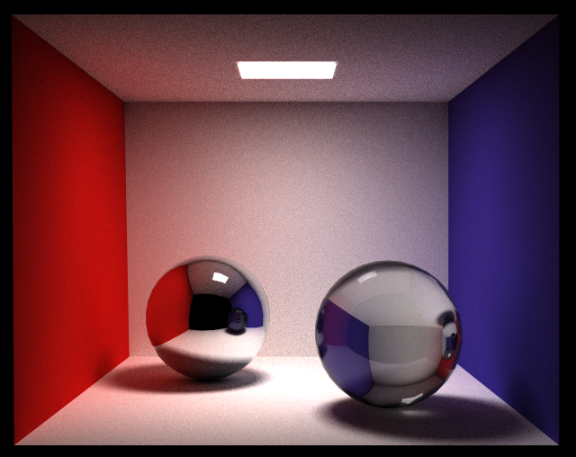

# tinyrt
A tiny but powerful raytracer written from scratch. Let's see how far I can get.

Here's a couple of things I'm striving for for this project:
1. Code is readably tiny.
2. State-of-the-art visual quality.
3. Performant.
4. Feature rich for its size.
5. No external dependencies other than available in stl.

Here's some current rendered results using path tracing:

